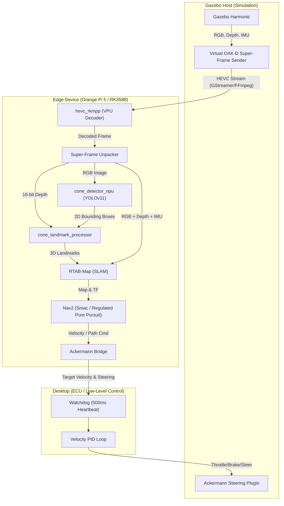

# Architecture Overview

This document provides a high-level overview of the ROS 2 Gazebo hybrid system, spanning the simulation host, edge device processing, and low-level ECU control.

## System Architecture

The following Mermaid diagram illustrates the flow of data, from the Virtual OAK-D camera in Gazebo down to the Ackermann control inputs, while highlighting where processing is distributed across hardware nodes.

## Furthest Development Stage

The system has advanced from geometric SLAM into **Semantic SLAM** and autonomous tracking:
1.  **Semantic NPU Integration:** A quantized YOLOv11 model runs at >20 FPS on the RK3588 NPU (`cone_detector_npu`), reliably detecting racing cones.
2.  **3D Landmark Injection:** Detections are projected into 3D using synchronized 16-bit depth (filtering depth holes via a 5x5 window) and natively injected into RTAB-Map as `LandmarkDetections` to assist with robust loop closures (`cone_landmark_processor`).
3.  **Nav2 Ackermann Control Split (v9 Hardened):** Global/local planning (Smac Hybrid-A* & Regulated Pure Pursuit) executes on the Edge device, while the desktop ECU handles high-frequency velocity PID, a 500ms heartbeat watchdog, and failsafe braking logic.

## Documented Failure Points & Bottlenecks

Throughout development, the following failures or system bottlenecks were encountered and are critical for future architectural decisions:

1.  **DDS Broadcast Storms:** Attempting to publish massive 1280x2400 raw frames on a global topic overwhelmed the CycloneDDS network over 1 Gbps links. **Solution:** Enforce local-only namespaces for raw buffers.
2.  **TF Tree Fragmentation:** The EKF node failed to anchor coordinate systems correctly when an IMU topic was missing or mismatched. **Impact:** Caused unconnected trees preventing RTAB-Map from initializing.
3.  **Setuptools Deprecation in Jazzy:** Dash-separated arguments in `setup.cfg` caused breaking build warnings on modern Ubuntu 24.04 setups. Underscores must be used.
4.  **UART Throughput & Latency:** High-baud UART links (921600) barely kept up with multiplexed telemetry and 20Hz control loops. **Risk:** Saturation of the serial bus if using plaintext messages over micro-ROS/binary.
5.  **RTAB-Map Transform Latency:** Loop closures sometimes take >200ms on the edge device, introducing lag in the `map -> odom` transform which causes sudden pose jumps for Nav2 tracking. **Risk:** Can disrupt tight racing lines unless heavily smoothed by local EKF (`transform_tolerance: 0.5`).
