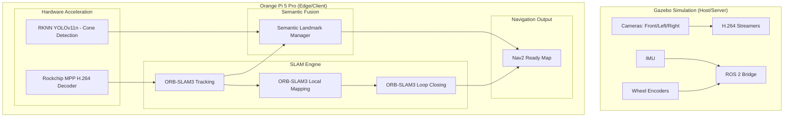

# [DEPRECATED] Edge Device SLAM Inference System (ORB-SLAM3)

**Note: This plan has been superseded by the RTAB-Map strategy in `plans/rtabmap_edge_slam_plan.md`.**

## Original Objective
Implement an edge-based SLAM inference system running on an Orange Pi 5 Pro (RK3588). The system consumes three H.264 video streams plus IMU and Odometry data over Ethernet from a Gazebo simulation. It utilizes an RKNN-accelerated YOLO model on the 6 TOPS triple-core NPU for cone detection and **ORB-SLAM3 (Visual-Inertial-Odometry)** for robust mapping and localization, fusing semantic landmarks for enhanced accuracy.

## Architecture

## Implementation Phases

### Phase 1: GStreamer & MPP Setup
1.  **MPP Installation**: Ensure `librga` and `libmpp` are installed on the Orange Pi.
2.  **Pipeline Optimization**: Configure the receiver to use `mppvideodec` for zero-CPU decoding.
3.  **Synchronization**: Implement a jitter buffer to handle network latency variations between the three video streams.

### Phase 2: NPU Acceleration (YOLOv11)
1.  **Model Conversion**: Export YOLOv11n from PyTorch to ONNX, then use `rknn-toolkit2` to convert to `.rknn` format.
2.  **Inference Node**: Create a C++ ROS 2 node that uses the RKNN API to run inference on the decoded MPP buffers.

### Phase 3: Minimal ORB-SLAM3 & RKNN Integration
1.  **Headless ORB-SLAM3 Build**:
    *   Cross-compile ORB-SLAM3 without Pangolin/OpenGL to eliminate GUI dependencies.
    *   Optimize for ARMv8-A (NEON).
2.  **Semantic Fusion**: Project 2D YOLO detections into 3D using ORB-SLAM3 depth/pose to create persistent landmarks.

## Resource Allocation (RK3588)
*   **NPU (3 Cores):** Dedicated to YOLOv11 inference (approx. 15-20ms per frame).
*   **VPU:** Dedicated to H.264 decoding.
*   **CPU (Cortex-A76 cores):** Dedicated to ORB-SLAM3 Tracking, Local Mapping, and Loop Closing threads.
*   **CPU (Cortex-A55 cores):** Dedicated to ROS 2 communication and system overhead.

## Key Challenges
1.  **Cross-Compilation Setup**: Configure `aarch64-linux-gnu` toolchain for ROS 2 and ORB-SLAM3 dependencies (OpenCV, Eigen3, Pangolin, DBoW2) with NEON SIMD enabled.
2.  **Memory Management**: Ensure efficient buffer sharing between MPP, RKNN, and ORB-SLAM3 to avoid excessive memory copying.
3.  **Time Sync**: Synchronize Gazebo simulation time with the edge device processing time to ensure accurate sensor fusion.
