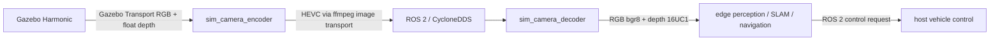

# Current Architecture

This describes repository state, not hardware acceptance. Status terms are in [VALIDATION.md](VALIDATION.md).

Host source is in `server_sim/src`; edge-targeted source is in `edge_stack/src`. A private ROS topic name is a namespace rule, not a guarantee that data stays local.

## Implemented camera path

`sim_camera_encoder` reads Gazebo Transport RGB/depth, accepts pairs within 50 ms, converts float metres to 16-bit millimetres, and publishes [the packed image](STREAMING_CONTRACT.md). The sender configures CycloneDDS and `hevc_nvenc` through `ffmpeg_image_transport`. The decoder unpacks RGB/depth and defaults to 5 Hz; `output_rate_hz` is configurable and `0` disables throttling.

## Known limitations

- Calibration defaults are parameterized in the decoder but are not yet generated from or shared with Gazebo.
- Compressed outputs use a bounded newest-frame worker queue; overload drops pending compression work by design.
- DDS routing depends on deployed configuration and interfaces.
- Perception, SLAM, navigation, racing, and telemetry source does not by itself prove integration or performance.

No NPU rate, bit-exact depth, semantic loop closure, failsafe control, or end-to-end success is asserted here.
