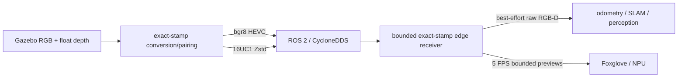

# Current Architecture

This describes repository source, not Orange Pi acceptance.

Host source is in `server_sim/src`; deployable edge source is in `edge_stack/src`.
The encoder converts depth once and emits two messages with identical Gazebo stamps
and `camera_link_optical`. The edge callbacks enqueue only shared messages; a worker
publishes the newest exact pair through shallow sensor-data QoS. Preview compression
and slow perception consumers use bounded newest-frame queues.

The edge launch composes decoder, RGB-D odometry, and RTAB-Map with intra-process
communication when SLAM is enabled. Flags isolate Foxglove, SLAM, NPU, landmarks,
and preview compression. Generated CycloneDDS XML is the canonical pipeline DDS
configuration and validates an explicitly requested interface/local address.

Known limitations remain calibration provenance, hardware codec option confirmation,
and all end-to-end rate, latency, bandwidth, depth-integrity, restart, and soak
evidence listed in [VALIDATION.md](VALIDATION.md).
