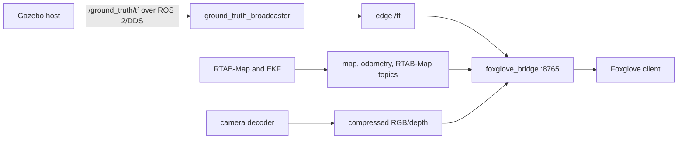

# [W.I.P] Foxglove Integration

This document describes the Foxglove bridge instantiated by `rtabmap_slam.launch.py`. It is implementation documentation, not proof that remote access or visualization has been tested; record those results in [VALIDATION.md](VALIDATION.md).

## Active bridge

The edge launch starts `foxglove_bridge` with:

- bind address `0.0.0.0`;
- WebSocket port `8765`;
- hidden topics excluded;
- services disabled through a non-matching whitelist;
- client publishing, parameter, connection-graph, and asset capabilities enabled.

The topic whitelist permits:

- `/tf` and `/tf_static`;
- `/map` and `/odometry/filtered`;
- `/rtabmap/*`;
- `/edge/camera/rgb/image_raw/compressed`;
- `/edge/camera/depth/image_raw/compressed`;
- `/yolo/*`.

Raw RGB and depth image topics are intentionally absent. Changing this whitelist changes remote bandwidth and exposure and should be treated as an interface change.

## Current data flow



The edge launch also publishes a static `world -> map` transform. The ground-truth broadcaster filters Gazebo pose messages for `ackermann_car`, publishes the selected transform with parent `world`, and names the child `ground_truth_base_link`.

## Network access

The launch exposes port 8765 on every edge interface. Authentication, encryption, firewall rules, VPN access, and routing are deployment responsibilities; the repository does not configure them. If using Tailscale or another VPN, verify that the port is reachable only by intended clients.

CycloneDDS controls ROS traffic between host and edge. Foxglove topic whitelisting limits what the WebSocket bridge advertises, but it does not itself constrain DDS to a particular physical interface.

## Verification

Run on the Orange Pi after starting `rtabmap_slam.launch.py`:

```bash
ros2 node info /foxglove_bridge
ros2 topic hz /ground_truth/tf
ros2 topic hz /odometry/filtered
ros2 topic list | sort
ss -ltnp | rg ':8765'
ros2 run tf2_tools view_frames
```

Expected TF relationships include:

- `world -> ground_truth_base_link` from `ground_truth_broadcaster` when host poses arrive;
- `world -> map` from the edge static publisher;
- the localization chain required by the running SLAM/EKF configuration.

Connect Foxglove to `ws://<orange-pi-address>:8765` only over a trusted network. Verify panels using whitelisted topics, then monitor edge CPU and network use while compressed images are visible.
In the Image panel, select `/edge/camera/rgb/image_raw/compressed` as the image and `/yolo/image_annotations` as the annotation topic. Bounding boxes use timestamp-aligned `visualization_msgs/msg/ImageMarker` line strips rendered client-side; `/yolo/annotated/compressed` is intentionally absent.


## Troubleshooting

- No listener on 8765: inspect `/foxglove_bridge` startup logs and package availability.
- Listener exists but the client cannot connect: check routing, firewall, VPN policy, and the selected Orange Pi address.
- Missing ground truth: verify `/ground_truth/tf` on both host and edge and check that the Gazebo model name matches `ackermann_car`.
- Missing map or odometry: diagnose RTAB-Map/EKF independently before Foxglove.
- High remote bandwidth: inspect subscribed panels and keep raw camera topics out of the whitelist.
