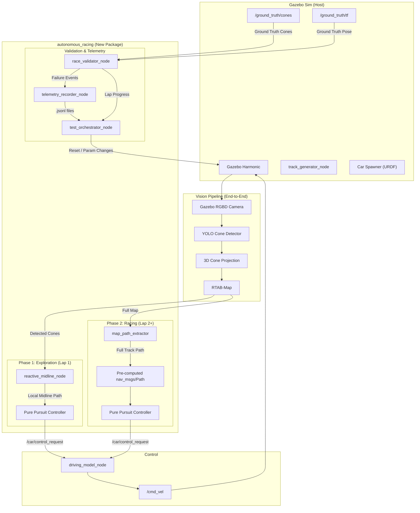
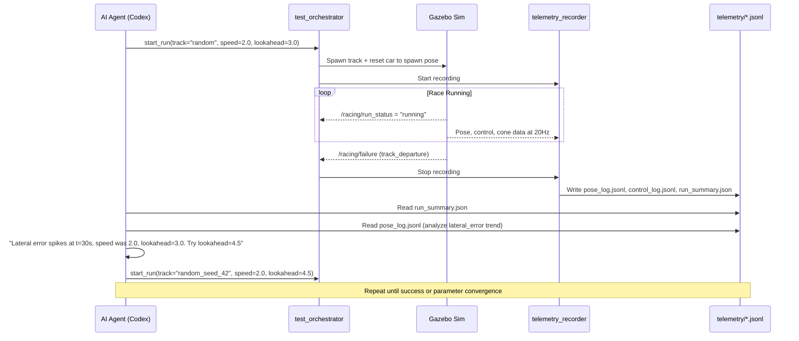

# [W.I.P] Autonomous Racing System — Implementation Plan

> **Design/implementation plan:** Phase labels do not establish verification. See [VALIDATION.md](VALIDATION.md).

> Based on in-depth design interview (2026-07-03)

## Architecture Overview



---

## Design Decisions Summary

| Decision | Choice |
|---|---|
| **Pathing Strategy** | Multi-lap progressive: reactive midline (Lap 1) → pre-computed path (Lap 2+) |
| **Perception Source** | Full vision pipeline (YOLO → 3D projection → RTAB-Map) |
| **Path Following** | Pure Pursuit controller |
| **Optimal Path** | Simple midline (average of inner/outer cone pairs) |
| **Failure Detection** | Track departure + timeout/stall |
| **Telemetry Format** | JSON Lines (.jsonl) per timestep |
| **Telemetry Scope** | All: pose log, control log, cone proximity, failure summary, run metadata |
| **Spawn Strategy** | Track defines spawn point (x, y, heading on centerline) |
| **Lap Detection** | Track-progress based (closest point on centerline > 95%) |
| **Reset Mechanism** | Gazebo world reset + re-spawn |
| **Validator Loop** | Agentic: agent reads logs → adjusts params → triggers re-run |
| **Speed** | Parameterized (launch parameter) |
| **Package** | New `autonomous_racing` package |

---

## New Package: `autonomous_racing`

### Package Structure
```
server_sim/src/autonomous_racing/
├── CMakeLists.txt
├── package.xml
├── setup.py                          # If ament_python
├── autonomous_racing/
│   ├── __init__.py
│   ├── nodes/
│   │   ├── __init__.py
│   │   ├── reactive_midline_node.py  # Phase 1: local midline from detected cones
│   │   ├── pure_pursuit_node.py      # Path-following controller
│   │   ├── race_validator_node.py    # Failure detection + lap tracking
│   │   ├── telemetry_recorder_node.py# Logs all data to .jsonl
│   │   └── test_orchestrator_node.py # Manages run lifecycle + agent API
│   ├── path_planning/
│   │   ├── __init__.py
│   │   ├── midline.py                # Midline computation from cone pairs
│   │   ├── cone_matching.py          # Match inner/outer cone pairs
│   │   └── progress_tracker.py       # Track-progress based lap detection
│   └── utils/
│       ├── __init__.py
│       └── telemetry_format.py       # JSONL serialization helpers
├── config/
│   ├── racing_params.yaml            # Tunable parameters
│   └── tuning_config.json            # Agent-readable config for tuning
├── launch/
│   └── autonomous_race.launch.py     # Full autonomous racing launch
└── telemetry/                        # Output directory for logs
    └── .gitkeep
```

---

## Node Specifications

### 1. `reactive_midline_node` — Exploration Phase Path Planner

**Purpose:** During Lap 1 (exploration), compute a local midline path from the cones currently visible to the car.

**Subscriptions:**
| Topic | Type | Description |
|---|---|---|
| `/rtabmap/landmarks` | `visualization_msgs/MarkerArray` | Detected cone positions from SLAM |
| `/odom` | `nav_msgs/Odometry` | Current car pose for local frame |

**Publications:**
| Topic | Type | Description |
|---|---|---|
| `/racing/local_path` | `nav_msgs/Path` | Local midline path (10-20 waypoints ahead) |
| `/racing/phase` | `std_msgs/String` | Current phase: "exploring" or "racing" |

**Algorithm:**
1. Collect detected cones within a forward-facing sector (±60°, 15m range)
2. Cluster cones into left/right groups using cross-track sign relative to heading
3. Sort each group by distance along heading direction
4. Compute midpoints between paired left/right cones
5. Fit a smooth path through midpoints
6. Publish as `nav_msgs/Path`

> [!IMPORTANT]
> When cone density is sparse (early in lap), fall back to heading-biased steering to prevent stalling.

---

### 2. `pure_pursuit_node` — Path-Following Controller

**Purpose:** Geometric path tracker that computes steering commands to follow a given path.

**Subscriptions:**
| Topic | Type | Description |
|---|---|---|
| `/racing/local_path` or `/racing/global_path` | `nav_msgs/Path` | Target path to follow |
| `/odom` | `nav_msgs/Odometry` | Current car pose + velocity |

**Publications:**
| Topic | Type | Description |
|---|---|---|
| `/car/control_request` | `geometry_msgs/TwistStamped` | Velocity + steering commands to driving model |

**Parameters:**
| Parameter | Default | Description |
|---|---|---|
| `lookahead_distance` | 3.0 | Base lookahead distance [m] |
| `lookahead_gain` | 0.5 | Speed-proportional lookahead gain |
| `target_speed` | 2.0 | Target linear velocity [m/s] |
| `min_lookahead` | 1.5 | Minimum lookahead distance [m] |
| `max_lookahead` | 8.0 | Maximum lookahead distance [m] |
| `wheelbase` | 1.0 | Vehicle wheelbase [m] (from URDF) |

**Algorithm:**
```
lookahead = max(min_lookahead, min(max_lookahead, lookahead_distance + lookahead_gain * velocity))
goal_point = find_point_on_path_at_distance(lookahead, current_pose)
alpha = atan2(goal_point.y - car.y, goal_point.x - car.x) - car.yaw
steering = atan2(2 * wheelbase * sin(alpha), lookahead)
```

---

### 3. `race_validator_node` — Failure Detection + Lap Tracking

**Purpose:** Monitors the race for failure conditions and tracks lap progress.

**Subscriptions:**
| Topic | Type | Description |
|---|---|---|
| `/ground_truth/tf` | `tf2_msgs/TFMessage` | Ground truth car pose |
| `/ground_truth/cones` | `visualization_msgs/MarkerArray` | Ground truth cone positions |
| `/odom` | `nav_msgs/Odometry` | Estimated car pose |
| `/cmd_vel` | `geometry_msgs/Twist` | Current control output |

**Publications:**
| Topic | Type | Description |
|---|---|---|
| `/racing/failure` | `std_msgs/String` | Failure event (JSON) |
| `/racing/lap_progress` | `std_msgs/Float32` | 0.0 → 1.0 progress around track |
| `/racing/lap_complete` | `std_msgs/Int32` | Lap counter |
| `/racing/run_status` | `std_msgs/String` | "running", "failed", "completed" |

**Failure Conditions:**

| Condition | Detection Method | Threshold |
|---|---|---|
| **Track departure** | Check if GT car pose is outside the convex hull of outer cones or inside inner cones | Distance to nearest boundary < 0 (crossed) |
| **Timeout/stall** | Track progress along centerline; if no forward progress for N seconds | `stall_timeout: 10.0` seconds |

**Lap Detection:**
- Pre-compute centerline from ground truth cones at startup
- At each GT pose update, find closest point on centerline → track progress (0.0 to 1.0)
- Lap complete when progress wraps past 0.95 → 0.05 transition

---

### 4. `telemetry_recorder_node` — Data Logger

**Purpose:** Records all telemetry data to JSONL files for post-mortem analysis.

**Output Directory:** `telemetry/run_YYYYMMDD_HHMMSS/`

**Files produced per run:**

| File | Content | Rate |
|---|---|---|
| `pose_log.jsonl` | `{t, x, y, yaw, vx, vy, steering, lateral_error}` | 20 Hz |
| `control_log.jsonl` | `{t, cmd_vx, cmd_wz, target_vx, actual_vx, throttle, brake}` | 20 Hz |
| `cone_proximity.jsonl` | `{t, nearest_cone_id, nearest_cone_dist, nearest_cone_side}` | 10 Hz |
| `run_summary.json` | Failure event, duration, laps, track, params, spawn pose | End of run |
| `run_config.json` | Full parameter dump at run start | Start of run |

**JSONL Pose Log Example:**
```json
{"t": 1234567890.123, "x": 5.2, "y": 3.1, "yaw": 0.45, "vx": 2.1, "vy": 0.01, "steering": 0.12, "lateral_error": 0.35}
```

**Run Summary Example:**
```json
{
  "run_id": "run_20260703_191500",
  "track_name": "random",
  "track_seed": 42,
  "spawn_pose": {"x": 0.0, "y": 22.5, "yaw": 1.57},
  "result": "failed",
  "failure_type": "track_departure",
  "failure_time": 45.3,
  "failure_pose": {"x": 12.1, "y": -8.3, "yaw": 2.1},
  "failure_velocity": 3.2,
  "laps_completed": 0,
  "lap_progress_at_failure": 0.67,
  "duration_seconds": 45.3,
  "parameters": {
    "target_speed": 2.0,
    "lookahead_distance": 3.0,
    "kp_vel": 1.2,
    "ki_vel": 0.1,
    "kd_vel": 0.05
  }
}
```

---

### 5. `test_orchestrator_node` — Run Lifecycle Manager

**Purpose:** Manages the full test lifecycle and provides the API for agentic tuning.

**Responsibilities:**
1. Initialize a run (set track, spawn car, start recording)
2. Monitor validator for failure/completion events
3. On failure/completion: stop recording, save telemetry, reset sim
4. Expose a service for the agent to trigger new runs with updated params

**Services:**
| Service | Type | Description |
|---|---|---|
| `/orchestrator/start_run` | Custom `.srv` | Start a new run with specified params |
| `/orchestrator/get_results` | Custom `.srv` | Get last run's summary JSON |
| `/orchestrator/update_params` | Custom `.srv` | Update tunable parameters |

**Parameters:**
| Parameter | Default | Description |
|---|---|---|
| `max_laps` | 3 | Max laps per run before declaring success |
| `stall_timeout` | 10.0 | Seconds of no progress = stall |
| `telemetry_dir` | `./telemetry` | Output directory |

---

## Track Spawn Point Changes

### Modifications to [track_layouts.py](../server_sim/src/my_gazebo_package/my_gazebo_package_py/track_layouts.py)

Each track layout gains a `spawn` field:

```python
TRACK_LAYOUTS = {
    "oval": {
        "points": [
            (0.0, 5.0), (1.0, 4.9), ...
        ],
        "spawn": {"x": 0.0, "y": 5.0, "yaw": 1.5708}  # Top of oval, facing right
    },
    ...
}
```

### Modifications to [track_builder.py](../server_sim/src/my_gazebo_package/my_gazebo_package_py/track_builder.py)

`generate_random_track()` returns a spawn point computed from the first path segment:

```python
def generate_random_track(...):
    ...
    # Compute spawn: midpoint of first segment, heading along it
    p0 = np.array(points[0])
    p1 = np.array(points[1])
    mid = (inner_cones[0] + outer_cones[0]) / 2  # Midpoint at start
    heading = np.arctan2(p1[1] - p0[1], p1[0] - p0[0])
    spawn = {"x": float(mid[0]), "y": float(mid[1]), "yaw": float(heading)}
    return inner_cones, outer_cones, spawn
```

### Modifications to [gazebo.launch.py](../server_sim/src/my_gazebo_package/launch/gazebo.launch.py)

The car spawn position uses the track's spawn point (communicated via a param or the orchestrator).

---

## Agentic Tuning Workflow



### Agent Interface (Shell Commands)

The agent interacts via standard CLI:

```bash
# Start a run
ros2 service call /orchestrator/start_run autonomous_racing/srv/StartRun \
  "{track_name: 'random', random_seed: 42, target_speed: 2.0, lookahead: 3.0}"

# Check status
ros2 topic echo /racing/run_status --once

# Read results after failure
cat telemetry/run_latest/run_summary.json | python3 -m json.tool

# Analyze lateral error
python3 -c "
import json
errors = [json.loads(l)['lateral_error'] for l in open('telemetry/run_latest/pose_log.jsonl')]
print(f'Max lateral error: {max(errors):.2f}m at sample {errors.index(max(errors))}')
"

# Update params and re-run
ros2 service call /orchestrator/start_run autonomous_racing/srv/StartRun \
  "{track_name: 'random', random_seed: 42, target_speed: 2.0, lookahead: 4.5}"
```

---

## Implementation Order

### Phase 1: Foundation (Do First)
1. [x] Create `autonomous_racing` package skeleton
2. [x] Add spawn points to track layouts + track builder
3. [x] Implement `pure_pursuit_node` (core controller)
4. [x] Implement `race_validator_node` (failure detection + lap progress)
5. [x] Implement `telemetry_recorder_node` (data logging)

### Phase 2: Path Planning
6. [x] Implement `reactive_midline_node` (exploration phase)
7. [ ] Implement midline computation from full cone map (racing phase)
8. [ ] Add phase transition logic (exploration → racing after lap 1)

### Phase 3: Integration
9. [x] Create `autonomous_race.launch.py`
10. [x] Implement `test_orchestrator_node` (lifecycle + agent API)
11. [ ] Modify car spawn to use track spawn points
12. [ ] Wire up the full vision pipeline (camera → YOLO → SLAM → midline → Pure Pursuit → driving model)

### Phase 4: Agentic Tuning
13. [ ] Create analysis scripts for telemetry
14. [x] Document the agent tuning workflow
15. [ ] Test end-to-end: spawn → race → fail → log → analyze → re-tune → re-run

---

## Key Tunable Parameters (Exposed to Agent)

| Parameter | Range | Impact |
|---|---|---|
| `target_speed` | 1.0 - 13.0 m/s | Higher = faster but harder to steer |
| `lookahead_distance` | 1.0 - 10.0 m | Higher = smoother but cuts corners |
| `lookahead_gain` | 0.0 - 2.0 | Speed-proportional lookahead scaling |
| `kp_vel` | 0.1 - 5.0 | Velocity PID proportional gain |
| `ki_vel` | 0.0 - 1.0 | Velocity PID integral gain |
| `kd_vel` | 0.0 - 0.5 | Velocity PID derivative gain |
| `steering_slew_rate` | 0.5 - 5.0 rad/s | How fast steering can change |
| `exploration_speed` | 1.0 - 3.0 m/s | Speed during mapping lap |
| `cone_cluster_range` | 5.0 - 20.0 m | How far ahead to look for cones |

> [!WARNING]
> The current `parameters.yaml` caps `max_velocity` at 2.0 m/s, but the Ackermann plugin allows 13.41 m/s. These must be reconciled — the URDF/plugin limit should be the true ceiling, and `parameters.yaml` should reflect the desired operating range.
