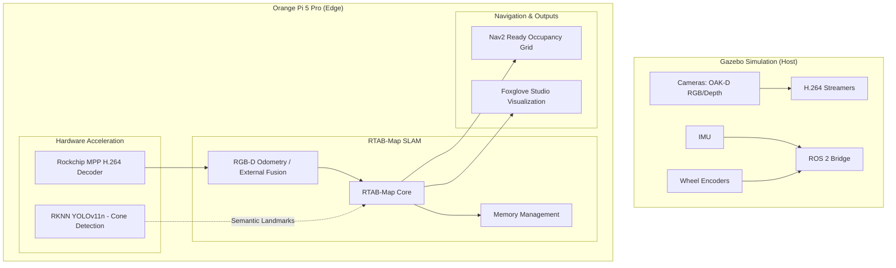

# Edge Device RTAB-Map SLAM System Plan

## Objective
Implement a robust, navigation-ready SLAM system on the Orange Pi 5 Pro (RK3588) using **RTAB-Map**. This replaces the previous ORB-SLAM3 plan to provide better integration with ROS 2 Nav2, easier sensor fusion (IMU + Wheel Odom), and persistent 2D/3D mapping for the Ackermann-steered car.

## Architecture

## Implementation Phases

### Phase 1: Dependency & Environment Setup
1.  **RTAB-Map Installation**: 
    *   *Warning*: Foxy binaries can be unstable on ARM64. If crashes occur, build `rtabmap_ros` from the `foxy-devel` source branch.
    *   `sudo apt install ros-foxy-rtabmap-ros ros-foxy-depthimage-to-laserscan`
2.  **DDS Optimization**: Switch to **Cyclone DDS** (`ros-foxy-rmw-cyclonedds-cpp`) to ensure reliable depth data transmission, as FastDDS often drops large packets on ARM64.
3.  **Workspace Update**: Create `rtabmap_bridge` node to handle incoming GStreamer buffers and convert them to `sensor_msgs/Image` using `cv_bridge`.

### Phase 2: Accelerated Video Pipeline
1.  **MPP Integration**: Update the GStreamer receiver to use `mppvideodec` instead of `avdec_h264` for hardware-accelerated decoding on the RK3588.
2.  **Zero-Copy Strategy**: Utilize `dmabuf` or shared memory pointers where possible in the `rtabmap_bridge` to minimize memory bus saturation during the VPU-to-ROS transition.
3.  **Strict Synchronization**: Implement an `ApproximateTime` synchronization policy in the bridge node with a 0.1s queue size to handle GStreamer/UDP jitter without dropping the RGB-D pairs.

### Phase 3: SLAM Configuration & Fusion
1.  **Odometry Strategy**:
    *   **Primary**: Use `rtabmap_ros/rgbd_odometry` for visual tracking.
    *   **Fusion**: Utilize `robot_localization` (EKF) to fuse Visual Odometry with Wheel Odometry (from Ackermann plugin) and IMU data.
    *   **Ackermann Constraints**: Configure the EKF with a differential or Ackermann motion model to penalize lateral drift and handle wheel slip during high-speed maneuvers.
2.  **RTAB-Map Tuning (RK3588 Specific)**:
    *   `Vis/MaxFeatures`: Set to `500` to balance accuracy and CPU load.
    *   `Mem/IncrementalMemory`: Set to `true` for SLAM, `false` for localization-only mode.
    *   `RGBD/LinearUpdate`: `0.1` (meters) to reduce map update frequency and save CPU.
    *   **Database Management**: Since the system has 16GB+ RAM, set `DbSqlite3/InMemory` to `true` or use a large page cache to eliminate SD card I/O bottlenecks during loop closures.

### Phase 4: Semantic Integration (Cones)
1.  **Landmark Injection**: Convert YOLO bounding boxes from the NPU into 3D points.
2.  **User Data**: Pass cone locations as "User Data" to RTAB-Map to create a semantic map where cones act as persistent landmarks for better loop closure.

### Phase 5: Navigation & Verification
1.  **2D Grid Generation**: Configure the `rtabmap` node to project the 3D cloud into a 2D `nav_msgs/OccupancyGrid` for Nav2.
    *   *Warning*: `depthimage_to_laserscan` is sensitive to encoding; ensure `16UC1` or `32FC1` are used to avoid node crashes.
2.  **Timing Adjustments**: Increase `transform_timeout` in the EKF and Nav2 to `0.2s` to account for RK3588 processing latency and prevent TF lookup failures.
3.  **Performance Benchmarking**:
    *   Monitor CPU usage (targeting <60% on A76 cores).
    *   Verify loop closure stability during high-speed Ackermann maneuvers.

## Why RTAB-Map over ORB-SLAM3?
1.  **Native 2D Mapping**: Immediate compatibility with navigation stacks.
2.  **Robustness**: Better handling of feature-poor environments via multi-sensor fusion.
3.  **Maintainability**: Avoids the complex custom patches and build requirements of ORB-SLAM3 on ROS 2.
