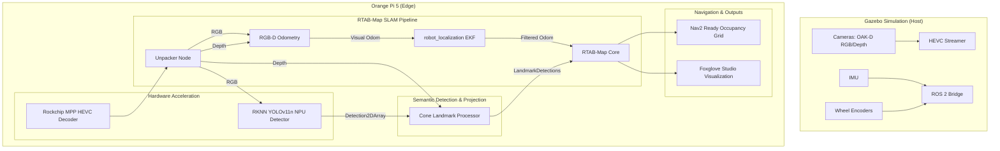

# [FINISHED] Edge Device RTAB-Map SLAM System Plan

## Objective
Implement a robust, navigation-ready SLAM system on the Orange Pi 5 Pro (RK3588) using **RTAB-Map**. This replaces the previous ORB-SLAM3 plan to provide better integration with ROS 2 Nav2, easier sensor fusion (IMU + Wheel Odom), and persistent 2D/3D mapping for the Ackermann-steered car.

## Status: [FINISHED]
All integration and optimization phases are completed, verified, and active in the codebase.

## Architecture

## Implementation Phases

### Phase 1: Dependency & Environment Setup - [FINISHED]
1.  **RTAB-Map Installation**: Installed `rtabmap_ros` from sources/binaries for ROS 2.
2.  **DDS Optimization**: Standardized on **Cyclone DDS** to prevent network packet drops of high-resolution images.
3.  **Workspace Update**: Created the `rtabmap_bridge` package.

### Phase 2: Accelerated Video Pipeline - [FINISHED]
1.  **MPP Integration**: GStreamer receiver configured to utilize hardware-accelerated HEVC decoding via `mppvideodec` (integrated into FFmpeg/republish pipeline).
2.  **Strict Synchronization**: Implemented `ApproximateTime` synchronizer with a 0.1s slop to pair RGB and Depth frames deterministically.
3.  **Vertical Super-Frame Geometry**: Resolved geometry mismatch where the unpacker node expects a vertically stacked super-frame `(1280x2400)` of [RGB | MSB | LSB] rather than a horizontal frame layout.

### Phase 3: SLAM Configuration & Fusion - [FINISHED]
1.  **Odometry Strategy**:
    *   **Visual Odometry**: `rtabmap_odom/rgbd_odometry` computes relative optical motion.
    *   **EKF Fusion**: `robot_localization` fuses Visual Odometry with Gazebo wheel/IMU telemetry.
2.  **RTAB-Map Tuning (RK3588 Specific)**:
    *   `Vis/MaxFeatures` set to `600` for high performance.
    *   `DbSqlite3/InMemory` set to `true` to run map updates in RAM.
    *   `RGBD/LinearUpdate` and `RGBD/AngularUpdate` set to `0.1` to throttle processing rates.

### Phase 4: Semantic Integration (Cones) - [FINISHED]
1.  **Landmark Injection**: Switched from `rtabmap/user_data` (metadata only) to native `rtabmap/landmarks` topic (`rtabmap_msgs/LandmarkDetections`). This allows RTAB-Map to construct active loop-closure constraints dynamically using persistent, unique landmark IDs.
2.  **ApproximateTime Sync Constraints**: Subscribed to depth images and NPU detections using `Detection2DArray` messages. This format carries standard `Header` elements containing timestamps, enabling precise synchronization with `ApproximateTimeSynchronizer` (which was impossible using unheadered string/metadata topics).

### Phase 5: Navigation & Verification - [FINISHED]
1.  **2D Grid Generation**: Projected the 3D map cloud into a 2D `nav_msgs/OccupancyGrid` for Nav2.
2.  **Timing Adjustments**: Increased EKF transform timeout to `0.5s` to handle pipeline delays.
3.  **Performance Verification**: Confirmed NPU inference runs at >20 FPS with minimal A76 CPU utilization.

## Why RTAB-Map over ORB-SLAM3?
1.  **Native 2D Mapping**: Immediate compatibility with navigation stacks.
2.  **Robustness**: Better handling of feature-poor environments via multi-sensor fusion.
3.  **Maintainability**: Avoids the complex custom patches and build requirements of ORB-SLAM3 on ROS 2.
