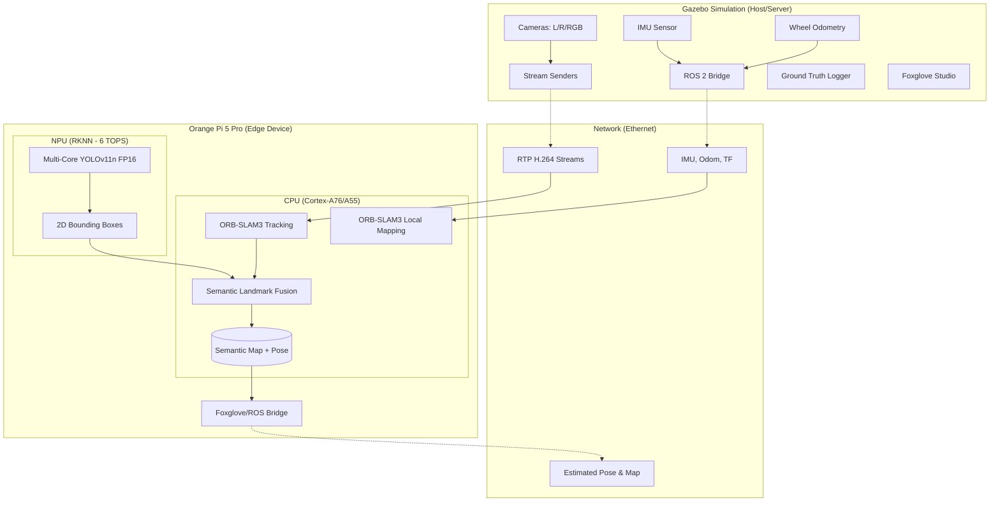

# Edge Device SLAM Inference System Plan

## Objective
Implement an edge-based SLAM inference system running on an Orange Pi 5 Pro (RK3588). The system consumes three H.264 video streams plus IMU and Odometry data over Ethernet from a Gazebo simulation. It utilizes an RKNN-accelerated YOLO model on the 6 TOPS triple-core NPU for cone detection and **ORB-SLAM3 (Visual-Inertial-Odometry)** for robust mapping and localization, fusing semantic landmarks for enhanced accuracy.

## Architecture

## Hardware Utilization Strategy (RK3588)
*   **NPU (RKNN):** Dedicated to YOLOv11n FP16 inference.
*   **CPU (Cortex-A55 cores):** Handles image capture, H.264 decoding, and YOLO pre/post-processing (NMS).
*   **CPU (Cortex-A76 cores):** Dedicated to ORB-SLAM3 Tracking, Local Mapping, and Loop Closing threads.
*   **Thermal Management:** Active cooling is mandatory to prevent throttling under concurrent load.

## Implementation Steps

### Phase 1: Preparation & Tooling
1.  **Git Branching**: Create `feature/edge-slam-inference`.
2.  **Cross-Compilation Setup**: Configure `aarch64-linux-gnu` toolchain for ROS 2 and ORB-SLAM3 dependencies (OpenCV, Eigen3, Pangolin, DBoW2) with NEON SIMD enabled.
3.  **YOLO RKNN Conversion**: Convert YOLOv11n cone detection model to FP16 `.rknn` format using `rknn-toolkit2`.

### Phase 2: Sensor & Telemetry Setup
1.  **Update Stream Senders**: Modify `left_image_subscriber.py` and `right_image_subscriber.py` to accept a `host` parameter.
2.  **Bridge Configuration**: Update `ros_gz_bridge.yaml` to include IMU (`/imu`) and Odometry (`/odom`) topics.
3.  **Ground Truth Logger**: Configure logging for actual pose and world state on the host for post-analysis.

### Phase 3: Minimal ORB-SLAM3 & RKNN Integration
1.  **Headless ORB-SLAM3 Build**: 
    *   Cross-compile ORB-SLAM3 without Pangolin/OpenGL to eliminate GUI dependencies.
    *   Enable NEON SIMD optimizations for the RK3588's Cortex-A76 cores.
    *   Produce a streamlined `libORB_SLAM3.so` for the ROS 2 node.
2.  **NPU Inference**: Implement the asynchronous YOLO inference pipeline using the `rknpu2` runtime.
3.  **Stream Decoding**: Efficiently decode H.264 streams on the Orange Pi using `mppvideodec` via GStreamer.
4.  **Deferred Optimizations**: Binary vocabulary conversion and OpenCL GPU acceleration are moved to Phase 6.

### Phase 4: Fusion & Semantic Mapping
1.  **VIO Frontend**: Run visual-inertial odometry using camera and IMU.
2.  **Semantic Fusion**: Project 2D YOLO detections into 3D using ORB-SLAM3 depth/pose to create persistent landmarks.
3.  **Odometry Integration**: Use wheel odometry for absolute scale and motion model constraints.

### Phase 5: Visualization & Benchmarking
1.  **Foxglove Live View**: Monitor the SLAM map and pose remotely.
2.  **Performance Analysis**: Compare SLAM trajectory against Gazebo ground truth (ATE/RPE) and monitor hardware utilization/thermals.
